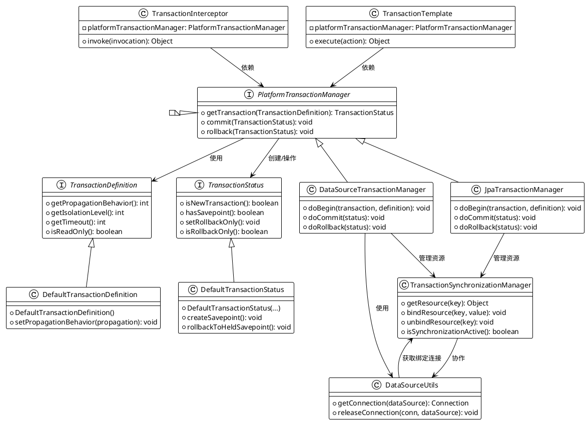
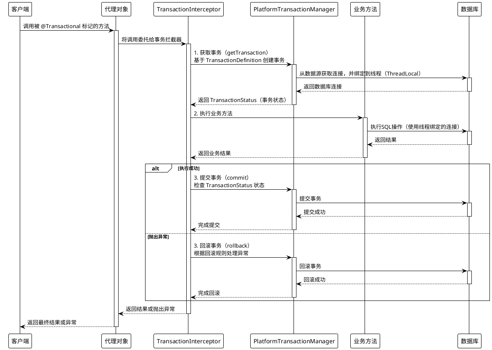

# spring:事务原理（摘自deepSeek）

## 一、原理说明

Spring 事务管理的核心原理是基于 **AOP（面向切面编程）** 和 **代理机制**，结合 **事务管理器**（`PlatformTransactionManager`）实现对事务的统一管理。以下是其核心原理的分步解析：

### 1. **事务管理的核心组件**

- **`PlatformTransactionManager`**：
  - 事务管理的核心接口，定义了事务的提交、回滚和获取事务状态的方法。
  - 常见实现类：`DataSourceTransactionManager`（JDBC）、`HibernateTransactionManager`、`JpaTransactionManager`等，针对不同持久化技术适配。
- **事务属性**：
  - 传播行为（Propagation）：如 `REQUIRED`（默认）、`REQUIRES_NEW` 等。
  - 隔离级别（Isolation）：如 `READ_COMMITTED`、`SERIALIZABLE` 等。
  - 超时时间（Timeout）、只读模式（Read-only）、回滚规则（Rollback rules）等。

### 2. **声明式事务（@Transactional）的实现**

- **动态代理机制**：
  - 使用 AOP 在运行时为被 `@Transactional` 注解标记的类或方法生成代理对象。
  - 若目标对象实现接口，默认用 **JDK 动态代理**；否则用 **CGLIB 代理**。
- **事务拦截器（`TransactionInterceptor`）**：
  - 代理对象会拦截目标方法的调用，通过 `TransactionInterceptor` 处理事务逻辑。
  - **事务的开启、提交、回滚** 在拦截器中统一管理。

### 3. **事务执行流程**

- **1. 开启事务**：
  - 根据 `@Transactional` 配置，通过 `PlatformTransactionManager` 创建一个新事务（若需要）。
  - 例如，传播行为为 `REQUIRED` 时，若当前无事务，则新建事务；否则加入已有事务。
- **2. 执行业务逻辑**：
  - 执行目标方法（如数据库操作）。
- **3. 提交或回滚事务**：
  - 若方法正常执行，提交事务。
  - 若抛出异常且符合回滚规则（默认对 `RuntimeException` 和 `Error` 回滚），则回滚事务。

### 4. **事务同步与资源绑定**

- **`TransactionSynchronizationManager`**：
  - 通过线程局部变量（ThreadLocal）管理事务上下文（如数据库连接）。
  - 确保同一事务中的所有操作共享同一个连接。
- **资源绑定**：
  - 例如，在 JDBC 中，`DataSourceUtils` 会从当前事务上下文中获取连接，而非直接从数据源获取。

### 5. **事务传播行为与嵌套**

- **传播行为**：
  - 如 `REQUIRES_NEW` 会挂起当前事务，开启新事务；`NESTED` 在嵌套事务中执行。
- **保存点（Savepoint）**：
  - 部分事务管理器（如 JDBC）支持嵌套事务通过保存点实现部分回滚。

### 6. **事务的回滚规则**

- 默认对 `RuntimeException` 和 `Error` 回滚，检查异常（Checked Exception）不回滚。
- 可通过 `@Transactional(rollbackFor = Exception.class)` 自定义回滚异常。

### 7. **编程式事务（TransactionTemplate）**

- 通过 `TransactionTemplate` 显式编码控制事务边界。
- 适用于需要细粒度控制事务的场景。

### **常见问题与注意事项**

1. **代理失效**：
   - 同类内部方法调用（如 `this.method()`）不会触发代理，导致事务失效。需通过 AOP 代理对象调用（如注入自身 Bean）。
2. **异常处理**：
   - 若异常被 `catch` 未抛出，事务不会回滚。
3. **多数据源事务**：
   - 需配置多个 `PlatformTransactionManager`，并用 `@Transactional(value = "txManager1")` 指定。
4. **分布式事务**：
   - Spring 通过 JTA 或整合 Seata 等框架支持，但通常需要外部协调器（如 Atomikos、Narayana）。

### **总结**

Spring 事务通过 **AOP 动态代理** 拦截目标方法，结合 **事务管理器** 和 **线程绑定资源** 的机制，实现了声明式事务管理。其核心在于对事务生命周期的统一控制（开启、提交、回滚）和传播行为的灵活配置。理解其原理有助于避免事务失效、死锁等常见问题。

---

## 二、Spring事务核心类

### **类图说明**

#### **1. 核心接口**

* **`PlatformTransactionManager`**
  事务管理器顶层接口，定义事务生命周期方法：
  * `getTransaction()`：根据定义创建事务
  * `commit()`/`rollback()`：提交或回滚事务
* **`TransactionDefinition`**
  定义事务属性：传播行为、隔离级别、超时、只读模式等。
* **`TransactionStatus`**
  表示事务运行时状态，如是否为新事务、是否有保存点、是否标记回滚等。

#### **2. 事务管理器实现**

* **`DataSourceTransactionManager`**
  基于 JDBC 的事务管理器，管理数据库连接的生命周期。
  关键方法：`doBegin()`（开启连接）、`doCommit()`、`doRollback()`。
* **`JpaTransactionManager`**
  JPA 事务管理器，适配 JPA 规范（如 Hibernate）。

#### **3. 默认实现类**

* **`DefaultTransactionDefinition`**
  `TransactionDefinition` 的默认实现，提供属性配置方法。
* **`DefaultTransactionStatus`**
  `TransactionStatus` 的默认实现，支持嵌套事务（保存点机制）。

#### **4. 事务拦截与模板**

* **`TransactionInterceptor`**
  AOP 事务拦截器，拦截 `@Transactional` 方法，调用 `PlatformTransactionManager` 管理事务。
* **`TransactionTemplate`**
  编程式事务模板，显式控制事务边界（如 `execute(TransactionCallback)`）。

#### **5. 资源绑定与同步**

* **`TransactionSynchronizationManager`**
  通过 `ThreadLocal` 管理事务上下文资源（如数据库连接），确保同一事务内资源共享。
  关键方法：`bindResource()`、`getResource()`。
* **`DataSourceUtils`**
  工具类，从 `TransactionSynchronizationManager` 获取线程绑定的连接，而非直接创建新连接。

### **协作流程**

1. **事务开启**
   * `TransactionInterceptor` 调用 `PlatformTransactionManager.getTransaction()`。
   * `DataSourceTransactionManager` 通过 `DataSourceUtils` 获取连接，并绑定到线程。
2. **资源操作**
   * 业务代码执行 SQL 时，通过 `DataSourceUtils.getConnection()` 获取线程绑定的连接。
3. **提交/回滚**
   * 成功时调用 `commit()`，释放连接。
   * 异常时调用 `rollback()`，回滚并释放资源。

### **关键设计思想**

* **抽象与扩展**：通过 `PlatformTransactionManager` 接口支持多种数据访问技术（JDBC、JPA 等）。
* **资源绑定**：利用 `ThreadLocal` 实现事务资源（如连接）的线程隔离。
* **AOP 整合**：通过动态代理和拦截器将事务逻辑与业务代码解耦。

此图涵盖了 Spring 事务的核心设计，可帮助理解事务管理器、资源同步及拦截机制的协作关系。

## 三、Spring 事务原理的核心流程图

### **流程图说明**

1. **客户端调用**：
   * 客户端调用被 `@Transactional` 注解标记的方法时，实际调用的是 Spring 生成的 **代理对象**（JDK 或 CGLIB 代理）。
2. **事务拦截器**：
   * 代理对象将调用委托给 `TransactionInterceptor`，由它统一管理事务逻辑。
3. **事务开启**：
   * 拦截器通过 `PlatformTransactionManager` 创建事务（根据 `TransactionDefinition` 配置），从数据源获取连接并绑定到当前线程（通过 `ThreadLocal`）。
4. **执行业务逻辑**：
   * 调用实际的业务方法，所有数据库操作使用线程绑定的连接。
5. **提交或回滚**：
   * **成功时**：提交事务，释放连接。
   * **异常时**：根据回滚规则（默认对 `RuntimeException` 和 `Error` 回滚），回滚事务。

### **关键点**

* **代理机制**：通过 AOP 生成代理对象，拦截事务方法。
* **资源绑定**：事务期间，数据库连接通过 `ThreadLocal` 绑定到当前线程，确保同一事务内操作共享连接。
* **事务管理器**：`PlatformTransactionManager` 是核心，负责事务生命周期管理。
* **异常回滚**：默认对非检查异常回滚，可通过 `@Transactional(rollbackFor=...)` 自定义。

#### 参考：

[Spring事务源码原理详解（保姆级）](https://blog.csdn.net/rongtaoup/article/details/127688984)
